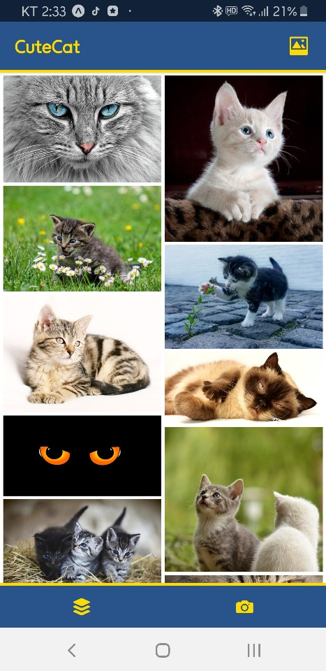

CuteCat

귀여운 고양이 사진 모음 앱.

## 설명.

---

자바스크립트를 공부하기 위해 사이드 프로젝트로 만들었습니다. 기존에 고양이를 너무 좋아해서 주제로 삼았습니다. :)

기능은 간단합니다. 고양이 사진을 보여주는 메인뷰와 카메라 기능 및 image Picker 기능을 구현하였습니다. 

서버는 express로 구현하였습니다. DB는 MongoDB를 사용하였습니다.

사용자가 이미지를 업로드하면 AWS S3에 올라가도록 하였으며,

혹시라도 고양이가 아닌 사진이 올라갈 경우를 필터링하기 위해 딥러닝 모델인 inception v3를 튜닝하여 고양이 사진 5만장, 고양이가 아닌 사진 5만장을 학습하였습니다.

사용자가 이미지 업로드를 요청한다면 서버는 딥러닝 서버에서 받은 결과 값을 판단하여 응답 하게 됩니다.

## 사용 언어 

- python
- javascript

## 사용 프레임 워크

- flask - 딥러닝 서버 구축
- express - 이미지 업로드 서버 구축
- react-native - 클라이언트 개발

## 사용 소프트 웨어 

- Nginx - flask의 경우 서버로 배포하는데 불안정한 모습이 있어 따로 웹서버 소프트 웨어를 사용했습니다.

## View

